# LIAVYS - Design with Dignity

A fully featured Ecommerce webapp built with Django 3.2.5, Python 3.8.5, React and Braintree payments.

[](https://www.python.org/downloads/release/python-360/)


### Live at https://liavys.herokuapp.com/

## Features Included

- Custom Admin dashboard
- Search Functionality
- Shopping Cart
- Product reviews and ratings
- Card,Gpay payments
- User profile with orders
- Admin product management
- Admin user management
- Admin order management
- Responsive, mobile-friendly design
- JWT authentication (JSON web tokens)
- Redux State Management
- Much more...

## Setup Instructions

**1.clone Repository & Install Packages**

```sh
git clone https://github.com/vishnu-sagubandi/LIAVYS_BACKEND.git
virtualenv env
cd env/bin/activate
pip install -r requirements.txt
```

**2.Change Database & Staticfiles configuration**

- Comment out django-storages & postgresql configuration in `settings.py` file

**3.Migrate & Start Server**

```sh
python manage.py makemigrations
python manage.py migrate
python manage.py runserver
```

### Setting up React (Optional)

```sh
cd frontend
npm install
npm start
```

## Previews

Home Page
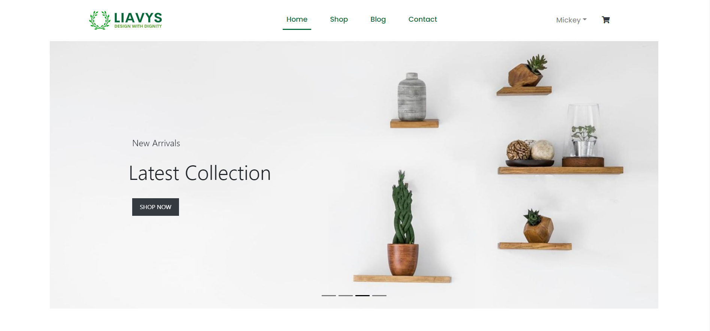
Shop Page
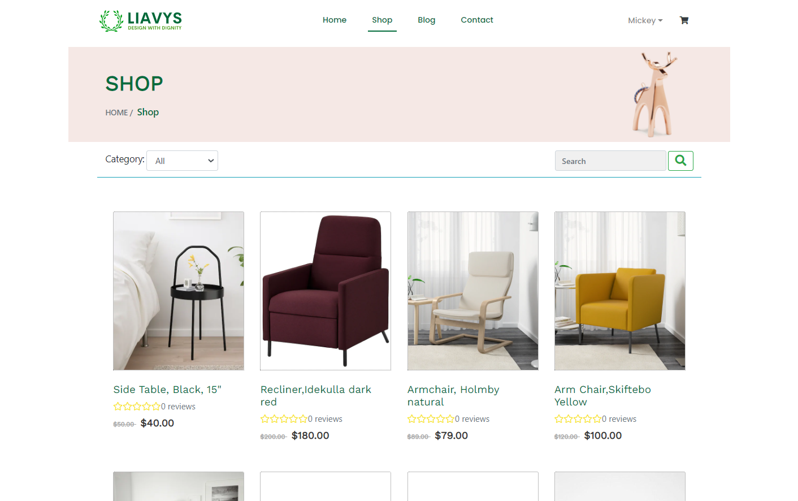
Product Page
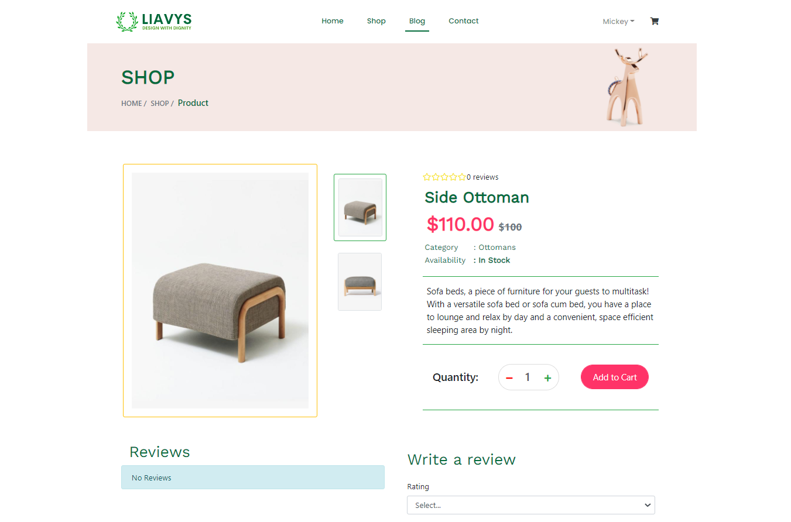
Cart Page
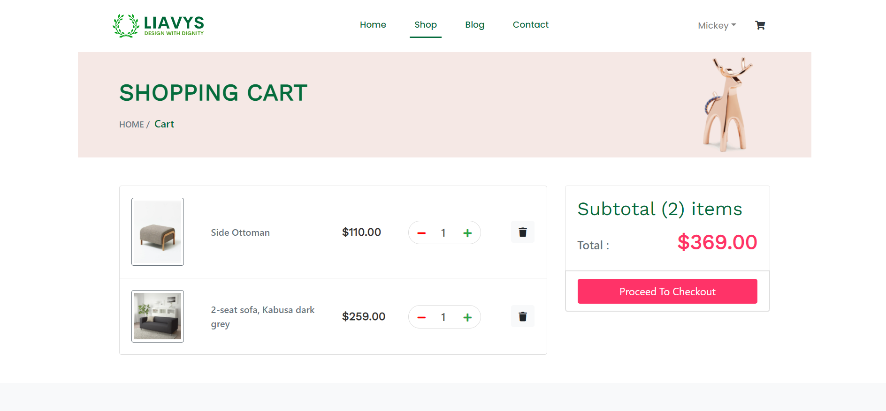
Shipping Page

Checkout Page
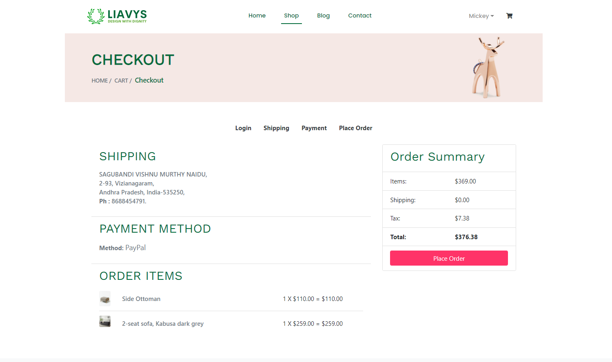
Signup Page
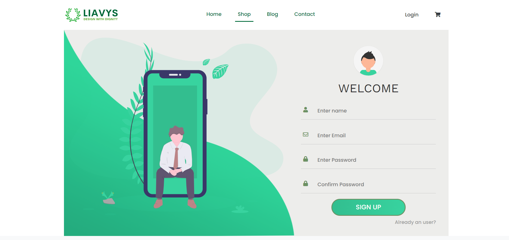
Login Page
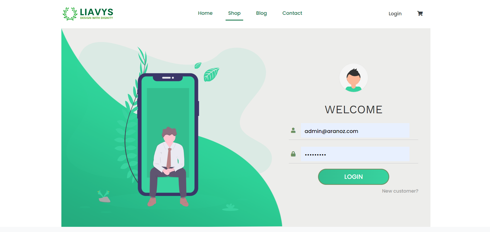
Profile Page
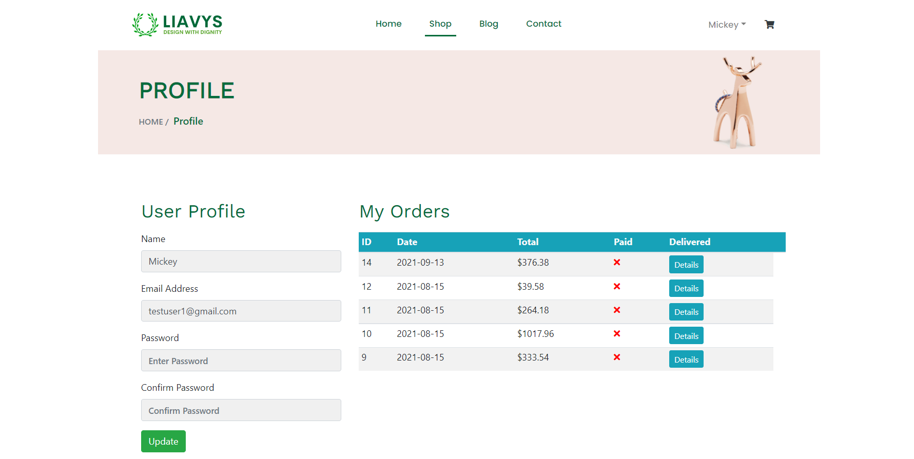
Order details Page
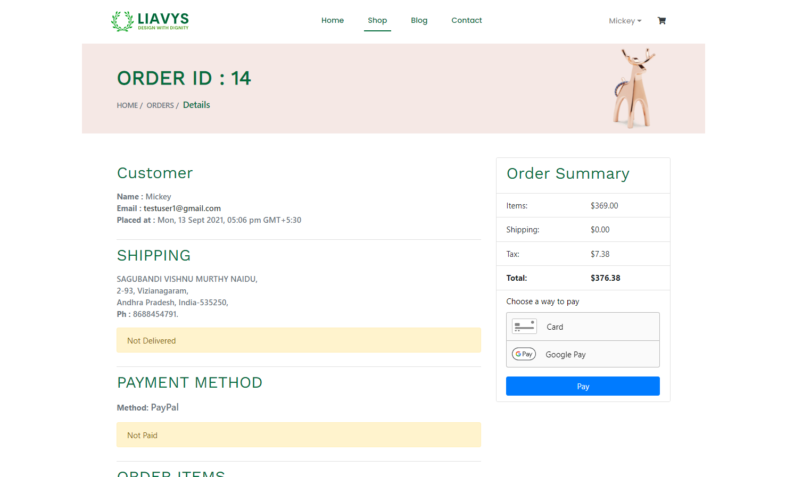
Admin users list Page
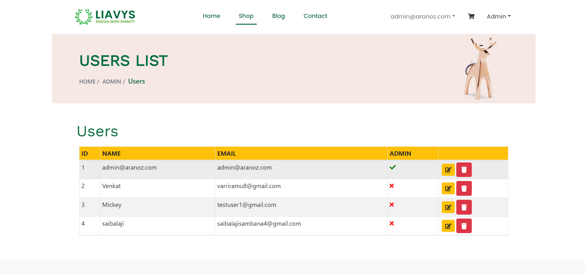
Admin products list Page
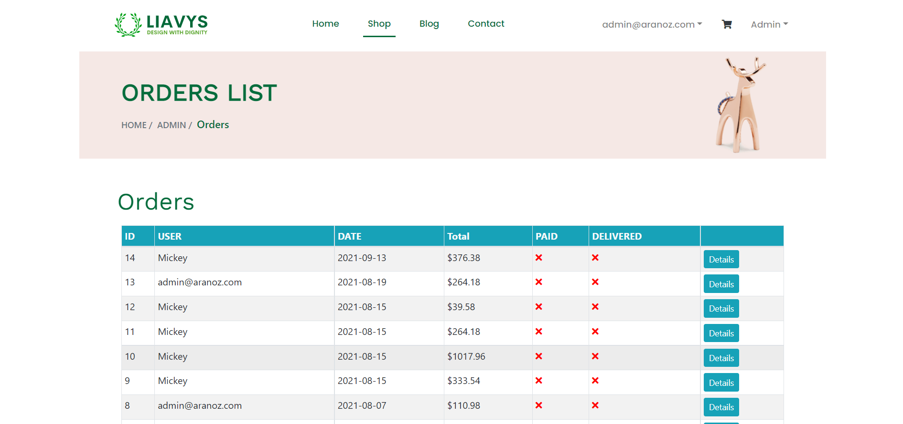
Admin orders list Page

Page 404
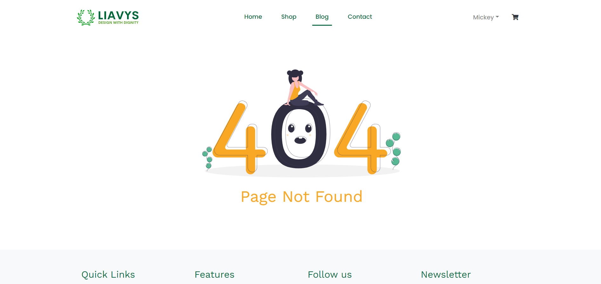

# Thank You
